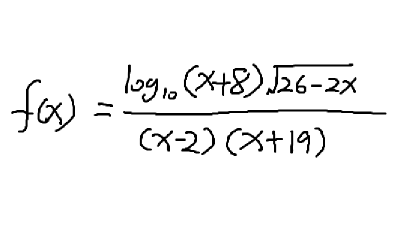

# 1.1 函数
函数是将一个对象转化为另一个对象的规则，起始对象称为输入，来自称为定义域的集合，返回对象称为输出，来自称为上域的集合。  
## 函数例子和定义域

`f(x) = x^2`  这就定义了一个函数f。  
- 在没有说明其定义域或上域，假设它们都属于R，即所有实数的集合（所以我们可以将任何实数平方，并得到一个实数）。  
- 转变后的对象不需要有别于原始对象。  
- `f`是一个变换规则，而`f(x)`是把这个变换规则应用于变量x后得到的结果。（因此说`f(x)`是一个函数是不正确的，应该说“`f`是一个函数。”）  
  
令`g(x) = x^2`，其定义域仅包含大于或等于零的数（这样的数称为非负的）。`g(-1/2)`却是没有定义的，函数g会拒绝非其定义域中的一切。  
- 虽然f与g有相同的规则，但g的定义域小于f的定义域，因而我们又说g是由限制f的定义域产生的。  
  
`f(x) = x^2`，f(马)是无定义的。  
- 若指定`h(x) = x` 的腿的数目，其中h的定义域是所有动物的集合：h(马) = 4，h(蚂蚁) = 6，h(鲑鱼) = 0。  
    - 因为动物腿的数量不会是负数或分数，所以h的上域可以是所有非负整数的集合。  
    - h(2)是没有定义的，因为2不在h的定义域中；  
    - h(椅子)也是没有定义的，因为椅子不是动物，椅子不在h的定义域中。  
  
令`j(x) = Junkster` 吃x时呕吐物的颜色，其中j的定义域是Junkster所吃的食物的集合，其上域是所有颜色的集合。  
- 为了行之有效，必须认为如果Junkster吃了玉米面卷，所产生的呕吐物始终是一种颜色。（如果有时候是红色，有时候是绿色，就不好了，**一个函数必须给每一个有效的输入指定唯一的输出**。  
  
## 值域和上域  
值域：值域是所有可能的输出所组成的集合。转变后的对象（包括重复的）所组成的集合称作值域。  
上域：是可能输出的集合，而值域是实际输出的集合。值域实际上是上域的一个子集。  
- 如果f(x) = x^2，其定义域和上域均为R，那么其值域是非负数的集合。（平方一个数，其结果不可能是负数。）  
- g(x) = x^2，其定义域仅为非负数，其上域仍是所有实数R，那么其值域还是非负数的集合。  
- h(x) 是动物x的腿的数目，值域：任何动物可能会有的腿的数目的集合，比如2 4 6 8 ……条腿的动物  
  
## 1.1.1 区间表示法
  
`[a, b]`：指从a到b端点间的所有实数。包括a和b。
- 所有`[a, b]`指：所有使得`a <= x <= b` 成立的 x 的集合。  
    - 例如`[2, 5]`是所有介于2和5之间（包括2和5）实数的集合。（不仅包括 2 3 4 5，还有处于2和5之间的无理数和分数）  
`(a, ∞)`：大于a，但不包括a的所有数。  
`[a, ∞)`：大于a，且包括a的所有数。  
`(    )`：开区间  
`[    ]`：闭区间  
`[    )`或`(    ]`：半开区间  

## 1.1.2 求定义域  
通常情况下，函数没有给出定义域时，惯例是定义域包括实数集尽可能多的部分。  
例如：`k(x) = √x`，其定义域就不可能是R中的所有实数，因为不可能得到一个负数的平方根。所以其定义域一定是`[0, ∞]`。（大于或等于0的所有实数的集合）  
  
一些数学的惯例：  
1. 分数的分母不能是零。  
2. 不能取一个负数的平方根（或四次根、六次根等）。  
3. 不能取一个负数或零的对数（有关“对数函数”，请看第9章）  

$f(x)=\frac {log_{10} (x+8) \sqrt{26-2x} } {(x-2)(x+19)}$

  
为了使f(x)有意义，f的定义域是？  
  
- 取`(26 - 2x)`的平方根，必须是非负，所以`26 - 2x >= 0`，`x <= 13`；  
- 取`(x + 8)`的对数，需要`x + 8 > 0`，所以`x > -8`；  
> 目前用区间表示f的定义域：`(-8, 13]`。  
- 分母不能为零，所以`(x-2) != 0`且`(x+19) != 0`；  
综合以上条件：f的定义域是除了2以外的集合`(-8, 13]`，写作`(-8, 13]\{2}`。

## 1.1.3 利用图像求值域
定义一个函数F，指定其定义域为`[-2,1]`，并且F(x) = x^2在此定义域上。